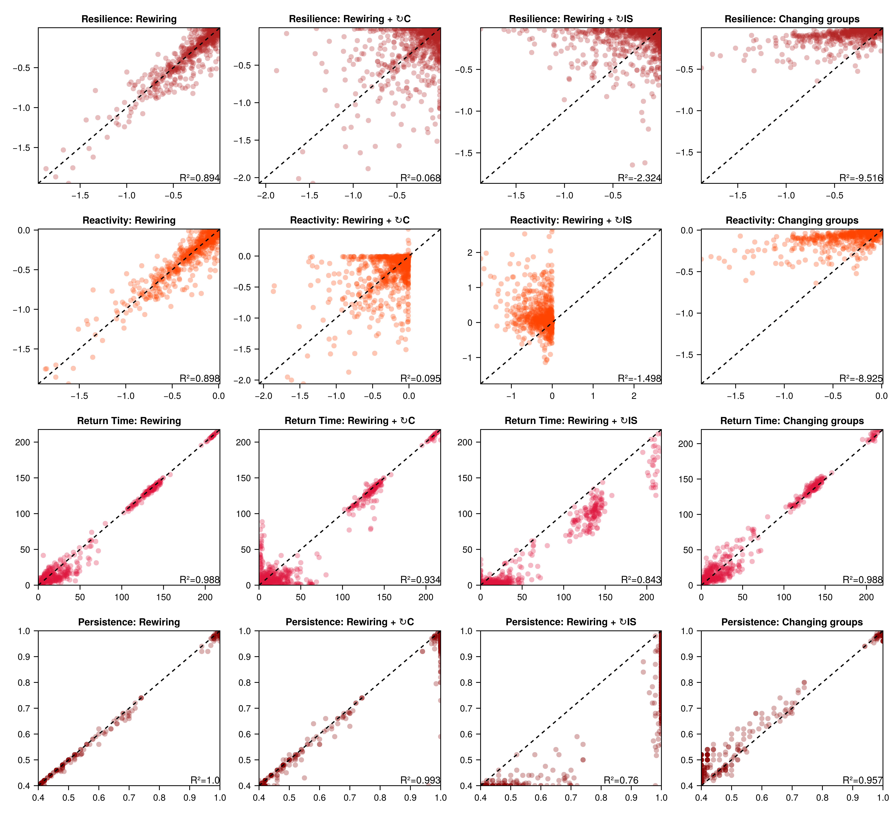
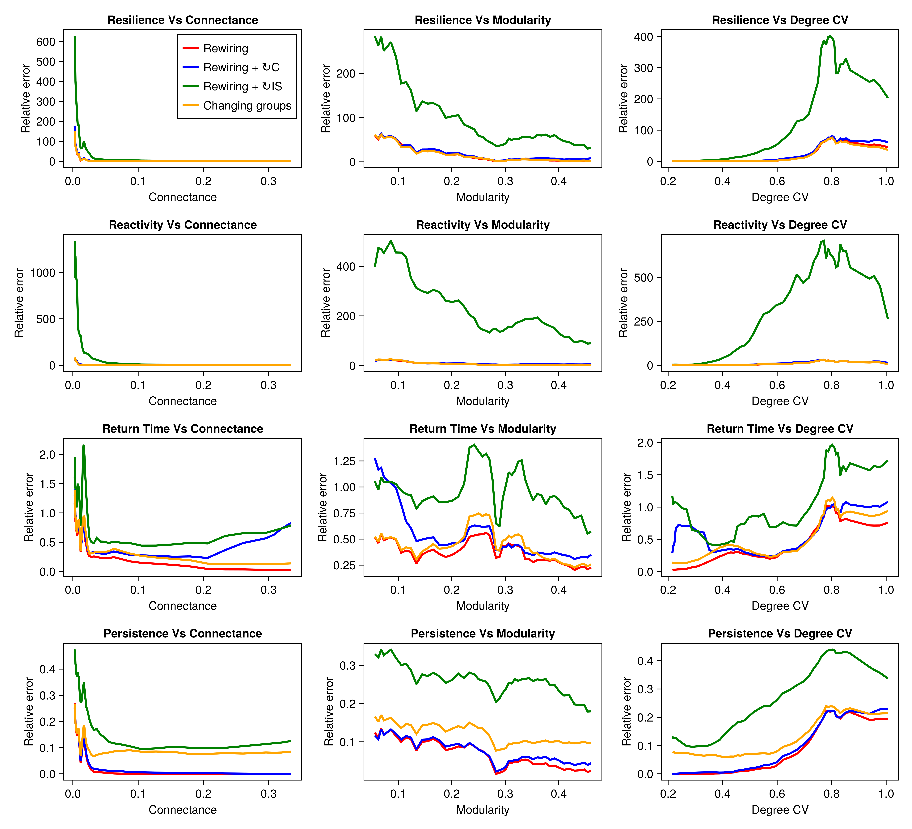

# From Structure🕸️ to Dynamics📈

[](link_to_paper)
[](LICENSE)

Official code for the paper:
> **"From Structure to Dynamics: A General View of Community-level Features"**  
> *Nicolàs Merino, Núria Galiana, Jean-François Arnoldi, Miguel B. Araújo*  
> Conference/Journal, Year

## 📌 Overview

This repository contains all the Julia code and data necessary to reproduce the analyses and figures presented in the article "From Structure to Dynamics: A General View of Community-level Features". It includes functions for generating ecological communities, applying network modifications, computing community- and species-level metrics, and performing the analyses described in the manuscript.

## 🗂️ Repository Structure
```bash
├── README.md               
├── Code/
  |── Functions.jl
  |── MainScript.jl # Only this script needs to be run
  |── PackageLoading.jl
  |── Plotting.jl                
├── Figures/
  |── Correlation_results_for_scenarios_ER_PL_MOD.png   # Figure 2 of the paper
  |── error_vs_structure.png                            # Figure 3 of the paper             
├── Outputs/                # .jls objects to be saved
├── paper.pdf               # PDF of the paper
├── Project.toml            # Package dependencies
├── Manifest.toml           # Pinned package versions for exact reproducibility. 
├── LICENSE                 # License information
```

## ⚙️ Installation
To set up the environment and install all dependencies:
```bash
# Clone the repository
git clone https://github.com/your-username/FromStructureToDynamics.git
cd FromStructureToDynamics

# Start Julia with the project environment
julia --project=.

# Inside Julia:
using Pkg
Pkg.instantiate()

# Finally, run:
Code/MainScript.jl
```
## 📊 Figures
Running MainScript.jl will allow you to generate Figure 2 and 3 from the paper. You can modify several arguments to match your interests, both content- and aesthetically-wise.
**Figure 2**


**Figure 3**



